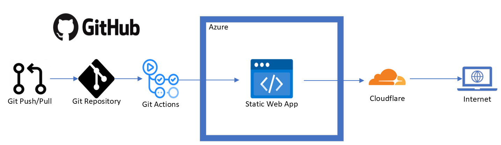

# #CloudGuruChallenge: Your resume in Azure

Here is my solution to the [Azure Resume Challenge](https://acloudguru.com/blog/engineering/cloudguruchallenge-your-resume-in-azure)

View it live [here](https://www.getchell.work)

## Prerequisites

- [GitHub account](https://github.com/join)
- [Azure account](https://azure.microsoft.com/en-us/free)
- [CloudFlare](https://www.cloudflare.com/)
- [Visual Studio Code](https://code.visualstudio.com)

## Front-end resources

The front-end is a static site with HTML, CSS, and JavaScript. It's static and has a visitor counter. The visitor counter data fetched via an API call to an Azure Function.

- I am a terrible designer, I used this [template](https://www.styleshout.com/free-templates/ceevee/) to create my site.

## Back-end resources

The back-end is an Azure Static Web. I choose to use this vs Azure Storage/CDN because I haven't seen it done for this challenge, it is free, and seems this will be used way more in the future.

- I used this [guide](https://learn.microsoft.com/en-us/azure/static-web-apps/getting-started?tabs=vanilla-javascript) as a start point.

## Cloudflare resources

I use Cloudflare for SSL/Proxy. It offers SSL for all URLs in the website, as Azure Static Web Hosting does not for certain URLs.

- Recommend this [guide](https://developers.cloudflare.com/support/third-party-software/others/enabling-cloudflare-ssl-on-azure-storage-static-web-hosting-applications/) as a start point.